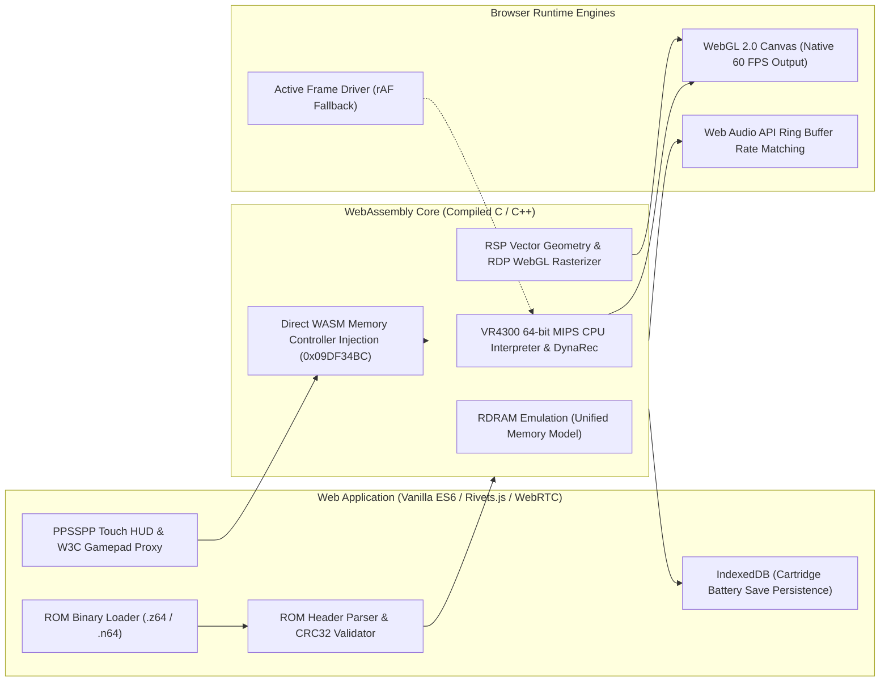

# ROMHub

ROMHub is a client-side Nintendo 64 emulation platform and deterministic multiplayer engine built on WebAssembly (WASM), WebGL, Web Audio, and WebRTC. It executes retro titles inside modern desktop and mobile web browsers at native 60 FPS without requiring native plugins, external software installations, or backend compute servers.

---

## Technical Overview & Emulation Core

### Core Identity: What is this Emulator?

ROMHub is powered by a WebAssembly port of the **Mupen64Plus** core (incorporating **ParaLLEl N64** and **GlideN64** graphics rasterization), compiled to WASM using the **Emscripten** toolchain. The foundational WebAssembly compilation and JavaScript runtime bridge originate from **N64Wasm** by Neil Barkhina (`nbarkhina/N64Wasm`).

The emulator fully models the Nintendo 64 hardware subsystems in browser memory:

1. **CPU Simulation (MIPS R4300i):** Executes the 64-bit RISC instruction set using a cycle-accurate interpreter and dynamic recompilation targeting WebAssembly bytecode.
2. **Reality Co-Processor (RCP):**
   - **Reality Signal Processor (RSP):** Vector DSP simulating geometry transformations, lighting, and audio command lists.
   - **Reality Display Processor (RDP):** Hardware rasterizer that translates N64 display lists, texture combine modes, and depth buffering into standard WebGL 1.0/2.0 shader draw calls.
3. **Audio Interface (AI):** Dynamic PCM audio generator piped into a custom Web Audio API ring buffer with rate matching to eliminate underflow crackling.
4. **Serial Interface (SI):** 4-player controller management, Controller Pak, Rumble Pak, and memory pak simulation.
5. **Peripheral Interface (PI) & Save Storage:** Cartridge DMA controller supporting battery-backed Static RAM (32KB SRAM), FlashRAM (128KB), and serial EEPROM (4Kbit/16Kbit), persisted locally via the browser's `IndexedDB`.

---

## Architectural Provenance & Attribution Matrix

ROMHub integrates upstream open-source emulation modules with custom, proprietary peer-to-peer networking, input virtualization, and mobile engine subsystems authored by **Dawid Czerwiński (Gzymson)**.

| Component / Layer | Primary Files | Provenance & Origin | Author / Maintainer | Key Responsibilities |
|---|---|---|---|---|
| **WASM Core Engine** | `n64wasm.wasm`<br>`n64wasm.js`<br>`assets.zip` | **Third-Party / Upstream** | Neil Barkhina (`nbarkhina/N64Wasm`), Mupen64Plus Team | C/C++ Mupen64Plus/ParaLLEl core compiled to WASM via Emscripten; MIPS R4300i CPU execution, RSP/RDP graphics pipelines, internal ROM loader, and shader asset bundles. |
| **WebRTC Netplay Engine** | `netplay.js` | **Authored by Dawid Czerwiński (Gzymson)** | Dawid Czerwiński | Dual-Mode multiplayer architecture (Mode A: Local WebGL ROM & Input Sync, Mode B: Remote Video Stream); P2P ROM chunk streaming (32KB slices) with CRC32 integrity verification; synchronized 3-2-1 countdown launch; proprietary 60 Hz 7-byte binary input protocol; Desync Guard state verification and auto-recovery. |
| **Input Virtualization & Memory Injection** | `netplay.js`<br>`input_controller.js` | **Authored by Dawid Czerwiński (Gzymson)** | Dawid Czerwiński | W3C Gamepad API Proxy intercepting `navigator.getGamepads()`; physical hardware gamepad isolation (`origGetGamepads`); Direct WASM Memory Controller Injection for 100% reliable 4-player multiplayer inputs; D-Pad to Analog fallback mapping. |
| **Virtual Touch HUD** | `touch_controller.js`<br>`css/style.css` | **Authored by Dawid Czerwiński (Gzymson)** | Dawid Czerwiński | Glassmorphic mobile HUD in the style of PPSSPP; dynamic floating 360-degree analog stick with radial clamping; dedicated C-Button diamond cluster (C-Up/Down/Left/Right), Z-trigger button, action buttons, multi-touch tracking, and haptic feedback (`navigator.vibrate`). |
| **Telemetry & Packet Inspector** | `logger.js`<br>`netplay.js` | **Authored by Dawid Czerwiński (Gzymson)** | Dawid Czerwiński | Real-time diagnostic console, high-frequency WebAssembly/WebRTC binary noise filter, live RTT (Round Trip Time) and PPS (Packets Per Second) metric engines, Live Controller Tester & Packet Inspector HUD. |
| **Engine Patches & Mobile Lifecycle** | `script.js` | **Modified / Extended by Dawid Czerwiński (Gzymson)** | Original base: N64Wasm; Patches: Dawid Czerwiński | Fixed root-cause C-core `mobileMode = 1` lockup disabling Player 2 in Netplay; Active Frame Driver and global AudioContext unlock for iOS/Android; IndexedDB safe initialization. |
| **Automated E2E Test Suite** | `scripts/test_netplay_e2e.js` | **Authored by Dawid Czerwiński (Gzymson)** | Dawid Czerwiński | Automated multi-client test harness orchestrating headless Chromium instances via Puppeteer; simulates Desktop Host and Mobile Guest (Pixel 7 viewport with touch emulation); validates WebRTC DataChannels, CRC32 transfers, and live Mario Kart 64 input frames. |
| **Third-Party Utility Libraries** | `js/peerjs.min.js`<br>`js/FileSaver.min.js`<br>`rivets.bundled.min.js`<br>`bootstrap 4` | **Third-Party Open Source** | PeerJS Org, Eli Grey, Michael Schiller, Bootstrap Team | WebRTC signaling abstraction, client-side save state downloads, two-way UI data binding, responsive modal and tab layouts. |

---

## System Architecture



```
+---------------------------------------------------------------------------------------------------+
|                                            Browser UI                                             |
|   [ Glassmorphic Touch HUD ]      [ W3C Gamepad API ]      [ Keyboard / Remapper ]      [ Lobby ] |
+-------------------------------------------------+-------------------------------------------------+
                                                  |
                                                  v
+---------------------------------------------------------------------------------------------------+
|                              ROMHub Netplay Engine (netplay.js)                                   |
|   - 7-byte Binary Input Serializer / Deserializer (60 Hz fixed rate)                             |
|   - W3C Gamepad Proxy & Direct WASM Memory Injection (Player Slots 0 to 3)                        |
|   - P2P Flow-Controlled ROM Streamer (32KB chunking with CRC32 verification)                      |
|   - Desync Guard & Memory State Snapshot Synchronization (Module._neil_serialize)                 |
|   - Real-time Diagnostic Logger, RTT / PPS Telemetry & Live Packet Inspector                      |
+-------------------------------------------------+-------------------------------------------------+
                                                  |
                                                  v
+---------------------------------------------------------------------------------------------------+
|                                 Emscripten JavaScript Bridge                                      |
|   - Runtime bindings (ccall, cwrap, Module._*)                                                    |
|   - SDL2 Joystick & Event Subsystem redirection                                                   |
|   - Web Audio ring buffer rate-matching & resampling                                              |
|   - Active Frame Driver & Mobile AudioContext unlock                                              |
+-------------------------------------------------+-------------------------------------------------+
                                                  |
                                                  v
+---------------------------------------------------------------------------------------------------+
|                            Mupen64Plus Core Engine (n64wasm.wasm)                                 |
|   - MIPS R4300i Dynamic Recompiler & Cycle-Accurate CPU Interpreter                               |
|   - Reality Co-Processor: RSP (Vector Geometry) & RDP (WebGL Rasterizer)                         |
|   - Serial Interface (SI) 4-Controller Bus                                                        |
|   - Cartridge DMA & IndexedDB Battery RAM (SRAM, FlashRAM, EEPROM 4K/16K)                         |
+---------------------------------------------------------------------------------------------------+
```

---

## Key Subsystems

### 1. Dual-Mode WebRTC Multiplayer Engine

ROMHub provides two distinct multiplayer topologies to balance input responsiveness and bandwidth requirements:

#### Mode A: Local WebGL ROM & Input Sync (Default)
In Mode A, all participating browsers execute an identical local instance of the WebAssembly core:
1. **Lobby & P2P ROM Chunking:** The host opens a room code (e.g. `ROM-TEST`). When a guest joins, the host reads the ROM buffer and transmits it over an unordered WebRTC DataChannel in 32KB chunks.
2. **CRC32 Integrity Gate:** The guest reassembles the binary in memory and calculates its CRC32 checksum. The guest transmits `CLIENT_ROM_READY` containing the checksum. The host validates it against its local checksum before unlocking the launch countdown.
3. **Synchronized Countdown Launch:** The host initiates `LAUNCH_SYNC`. Both browsers execute an identical 3-2-1 visual countdown, initializing the WASM runtime simultaneously at timestamp zero.
4. **Deterministic 60 Hz Input Exchange:** Every 16 ms (`setInterval`), players transmit their 7-byte binary input state. Incoming packets are injected directly into the target controller slot.
5. **Desync Guard:** Every 8 seconds, the host executes `Module._neil_serialize()` to capture the machine state, calculates a checksum, and broadcasts it. If a mismatch is detected, the host streams `/savestate.gz` to guests, which invoke `Module._neil_unserialize()` to restore exact synchronization.

#### Mode B: Remote Canvas Video Stream
In Mode B, only the host executes the WebAssembly core:
1. The host captures the WebGL canvas using `canvas.captureStream(60)` along with the audio mix.
2. The stream is transmitted to guests over a WebRTC `MediaStream` peer connection.
3. Guests display the video feed and stream their controller input back to the host via DataChannel.

### 2. Direct WASM Memory Controller Injection

Standard browser event dispatching, DOM input listeners, and Emscripten SDL2 polling pipelines introduce event queuing latency, jitter, and dropped frames under high CPU loads or background tab scheduling.

To guarantee zero packet drop and deterministic multi-client synchronization, ROMHub implements Direct WASM Memory Controller Injection in `netplay.js`:

1. **Memory Addressing:** The Mupen64Plus C core maintains internal controller structures in WebAssembly linear memory at fixed byte offset `165652540` (`0x09DF34BC`).
2. **Buffer View Direct Access:** The engine references Emscripten's underlying linear memory views:
   - `Module.HEAP32.buffer` for 32-bit integer button masks and connection flags.
   - `Module.HEAPF32.buffer` for 32-bit floating-point analog stick coordinate vectors.
3. **Stride Indexing:** Each of the 4 N64 controller slots occupies a 20-word (80-byte) aligned block:
   ```javascript
   const baseWord = (baseAddress / 4) + (slot * 20);
   i32[baseWord + 0] = 1; // Connected flag
   i32[baseWord + 1] = buttons[12] ? 1 : 0; // D-Pad Up
   i32[baseWord + 2] = buttons[13] ? 1 : 0; // D-Pad Down
   i32[baseWord + 3] = buttons[14] ? 1 : 0; // D-Pad Left
   i32[baseWord + 4] = buttons[15] ? 1 : 0; // D-Pad Right
   i32[baseWord + 5] = buttons[9] ? 1 : 0;  // Start
   i32[baseWord + 7] = buttons[5] ? 1 : 0;  // R
   i32[baseWord + 8] = buttons[6] ? 1 : 0;  // L
   i32[baseWord + 9] = buttons[4] ? 1 : 0;  // Z
   i32[baseWord + 10] = buttons[0] ? 1 : 0; // A
   i32[baseWord + 11] = buttons[2] ? 1 : 0; // B
   f32[baseWord + 12] = stickX;             // Analog X (-1.0 to 1.0)
   f32[baseWord + 13] = stickY;             // Analog Y (-1.0 to 1.0)
   i32[baseWord + 16] = cLeft ? 1 : 0;      // C-Left
   i32[baseWord + 17] = cRight ? 1 : 0;     // C-Right
   i32[baseWord + 18] = cUp ? 1 : 0;        // C-Up
   i32[baseWord + 19] = cDown ? 1 : 0;      // C-Down
   ```
4. **Execution Hook:** `injectControllerMemory()` is invoked directly before `Module._runMainLoop()` inside both the Web Audio process callback and the Active Frame Driver, guaranteeing that controller inputs are updated atomically immediately before the MIPS CPU and Serial Interface (SI) execute each emulation frame.

### 3. Active Frame Driver & Mobile AudioContext Autoplay Decoupling

In legacy N64Wasm ports, the emulator's execution loop (`Module._runMainLoop()`) was coupled exclusively to Web Audio buffer callbacks (`onaudioprocess` via `ScriptProcessorNode`). This created a fatal failure mode on mobile browsers:

- **The Problem:** Modern iOS Safari and Android Chrome enforce strict autoplay policies, keeping the `AudioContext` in a `suspended` state until an unambiguous user gesture occurs on an audio element. As a consequence, no audio callbacks fired, and the C++ Mupen64Plus emulator froze at boot (blank canvas).
- **The Solution:** ROMHub decouples execution from audio callbacks via a dual-drive system in `script.js`:
  1. `setupAudioUnlocks()` installs passive, non-blocking touch and key event listeners on `['touchstart', 'touchend', 'click', 'keydown', 'mousedown']` that invoke `this.audioContext.resume()`.
  2. `startFrameDriver()` initializes an autonomous `requestAnimationFrame` loop that checks the audio state. If `this.audioContext` is suspended or inactive, the driver manually steps `Module._runMainLoop()`, rendering frames at 60 FPS regardless of mobile audio restrictions.

### 4. Emscripten SDL2 Gamepad Pre-Firing & Proxy Isolation

When running in browser environments, two subtle integration barriers affect multi-controller support:

1. **SDL2 Joysticks Allocation Trap:** Emscripten's compiled SDL2 layer does not allocate joystick structures for Player 2, 3, or 4 unless a `gamepadconnected` event is dispatched on the `window` object. To ensure that Mupen64Plus recognizes incoming remote players, `netplay.js` dispatches synthetic `GamepadEvent('gamepadconnected')` instances for slots 0 through 3 during lobby connection.
2. **Infinite Recursion Guard:** `navigator.getGamepads` is virtualized to inject remote player inputs into slots 1-3. To prevent recursive polling loops and input stomping when local hardware pads are sampled, the original browser implementation is cached at initialization (`this.origGetGamepads = navigator.getGamepads.bind(navigator)`). Local hardware pads are queried exclusively through this unpatched reference.
3. **C-Core `mobileMode` Disabling:** In upstream N64Wasm, enabling mobile mode (`mobileMode = 1` in `config.txt`) forced the C engine to route inputs through `neil_send_mobile_controls`, which locked Player 2 out of controls. ROMHub guarantees that in Netplay sessions `mobileMode` is forced to `0`, ensuring that the full 4-controller SDL2 bus remains active.

### 5. Flow-Controlled P2P ROM Chunk Streaming & CRC32 Verification

Transferring 8MB to 32MB cartridge binaries over WebRTC DataChannels requires strict flow control to prevent SCTP buffer exhaustion:

1. **32KB Chunking:** The host divides the binary array buffer into sequential 32KB slices, transmitting metadata headers (`ROM_START`) with chunk counts and total payload byte size.
2. **SCTP Backpressure Management:** Sending binary frames continuously over saturated connections causes WebRTC buffers to overflow, triggering ICE disconnections. ROMHub monitors `conn.dataChannel.bufferedAmount`. If buffered bytes exceed 256KB, the stream yields with micro-sleeps until the buffer drains below threshold.
3. **CRC32 Verification Gate:** Upon reassembling all chunks, the guest calculates the binary CRC32 checksum across the complete buffer using a precomputed 256-entry lookup table (`0xEDB88320`). The guest transmits `CLIENT_ROM_READY` with the calculated hash. The host compares this hash with its local ROM checksum before unlocking the synchronized launch button.

---

## 7-Byte Binary Input Protocol Specification

Input packets are serialized into fixed 7-byte binary buffers transmitted at 60 Hz over WebRTC DataChannels:

```
+--------+------------+-------------------+------------------+---------------+---------------+-------------------+
| Byte 0 |   Byte 1   |      Byte 2       |      Byte 3      |    Byte 4     |    Byte 5     |      Byte 6       |
+--------+------------+-------------------+------------------+---------------+---------------+-------------------+
|  0x01  | PlayerSlot | Buttons High Byte | Buttons Low Byte | Analog StickX | Analog StickY | Sequence ID (0-255)|
+--------+------------+-------------------+------------------+---------------+---------------+-------------------+
```

### Byte Layout
- **Byte 0 (`0x01`):** Packet header identifying the payload as `TYPE_INPUT`.
- **Byte 1 (`PlayerSlot`):** Target player index (`0 = P1`, `1 = P2`, `2 = P3`, `3 = P4`).
- **Byte 2 (`Buttons High Byte`):** Bitmask for buttons 8 through 15.
- **Byte 3 (`Buttons Low Byte`):** Bitmask for buttons 0 through 7.
- **Byte 4 (`Analog StickX`):** Unsigned integer `0..255` (`128` = neutral, `0` = full left, `255` = full right).
- **Byte 5 (`Analog StickY`):** Unsigned integer `0..255` (`128` = neutral, `0` = full down, `255` = full up).
- **Byte 6 (`Sequence ID`):** Rolling sequence counter `0..255` for packet loss and latency calculation.

### Button Bitmask Mapping

| Bit Index | Controller Input | W3C Gamepad Button | N64 Target Mapping |
|:---------:|:-----------------|:------------------:|:-------------------|
| 0 | Action A | Button 0 | `Joy_Mapping_Action_A` (0) |
| 1 | Alt B | Button 1 | Unused |
| 2 | Action B | Button 2 | `Joy_Mapping_Action_B` (2) |
| 3 | Button Y | Button 3 | Unused |
| 4 | Z Trigger | Button 4 | `Joy_Mapping_Action_Z` (4) |
| 5 | R Trigger | Button 5 | `Joy_Mapping_Action_R` (5) |
| 6 | L Trigger | Button 6 | `Joy_Mapping_Action_L` (6) |
| 7 | ZR / R2 | Button 7 | Unused |
| 8 | Select | Button 8 | Unused |
| 9 | Start | Button 9 | `Joy_Mapping_Action_Start` (9) |
| 10 | Stick Click | Button 10 | Unused |
| 11 | Menu | Button 11 | `Joy_Mapping_Menu` (11) |
| 12 | D-Pad Up / C-Up | Button 12 | `Joy_Mapping_Up` (12) |
| 13 | D-Pad Down / C-Down | Button 13 | `Joy_Mapping_Down` (13) |
| 14 | D-Pad Left / C-Left | Button 14 | `Joy_Mapping_Left` (14) |
| 15 | D-Pad Right / C-Right | Button 15 | `Joy_Mapping_Right` (15) |

---

## PPSSPP-Grade Glassmorphic Virtual Gamepad

Designed for touchscreens in `touch_controller.js`:
- **Dynamic Floating 360 Analog Stick:** Automatically instantiates at the exact screen location where the player touches the left half of the display, with radial deflection clamping.
- **Ergonomic N64 Layout:**
  - Dedicated Z-trigger button located directly beneath the analog thumb area.
  - Action buttons A and B with visual active glow.
  - Dedicated C-Buttons diamond cluster (C-Up, C-Down, C-Left, C-Right).
  - Upper shoulder bumpers (L, R) and Start button.
- **Multi-Touch Engine:** Independent touch identifier tracking allows simultaneous stick movement, trigger holding, and rapid button tapping without ghosting.
- **Haptic Feedback:** Optional micro-vibrations via `navigator.vibrate`.

---

## Telemetry, Diagnostics & Live Controller Inspector

The in-app diagnostic suite in `logger.js` and `netplay.js` provides comprehensive real-time telemetry and debugging instrumentation:

1. **Live Controller Tester HUD:** Located directly inside the host and guest multiplayer lobbies. Renders real-time visual button state badges (`A`, `B`, `Z`, `START`, `L`, `R`, `UP`, `DOWN`, `LEFT`, `RIGHT`) and floating-point analog stick coordinate vectors (`X: 0.00, Y: 0.00`) for both Player 1 and Player 2 before launching the game.
2. **Bidirectional Packet Inspector Bar:** Tracks live transport metrics updated every 500 ms:
   - Packets Per Second: Transmitted (`ppsSent`) and received (`ppsReceived`).
   - Bandwidth Throughput: Upload and download byte rates in KB/s.
   - RTT Latency: Round-trip time calculated via continuous 1 Hz PING/PONG heartbeats.
   - Raw Packet Inspector: Live hex readout of the most recent incoming binary packet (`[0x01, slot: 1, btns: 0x0000, X: 128, Y: 128]`).
3. **Console Interception & Noise Suppression:** Captures `console.log`, `console.info`, `console.warn`, and `console.error` calls into a rolling circular buffer of 800 entries. High-frequency WebGL shader spam and raw WebRTC binary packet notifications are filtered out to keep browser developer tooling performant.
4. **Diagnostic System Dumps:** One-click full diagnostic export (`generateFullReport()`) combining user agent, WebGL context properties, touch capabilities, WebRTC ICE connection states, controller buffers, and the circular console log into a single plaintext format for incident triage.

---

## File Structure

```
ROMHub/
|-- css/
|   `-- style.css                    # Glassmorphism styling, responsive canvas viewport, PPSSPP HUD
|
|-- js/
|   |-- FileSaver.min.js             # Client-side file saving utility
|   |-- nipplejs.min.js              # Legacy touch fallback library
|   `-- peerjs.min.js                # WebRTC signaling and DataChannel client
|
|-- scripts/
|   |-- test_netplay_e2e.js          # Synthetic multi-client Puppeteer WebRTC E2E test suite
|   |-- test_mariokart_real_e2e.js   # Real 12MB Mario Kart 64 full E2E boot and framebuffer test
|   |-- test_mariokart_char_select.js# Touch controller menu navigation and character select verification
|   |-- test_mariokart_full_gameplay.js # 2-player simultaneous Netplay character select test
|   |-- test_guest_start_and_menu.js # Guest lobby start and in-game menu interactions
|   `-- test_reproduce_live_issues.js# Live lobby diagnostic and packet inspector validation
|
|-- index.html                       # Main application entry point, viewport layout, lobby modals
|-- netplay.js                       # WebRTC engine, Gamepad proxy, CRC32 streaming, Desync Guard
|-- script.js                        # Application lifecycle coordinator and Emscripten bindings
|-- touch_controller.js              # PPSSPP-style virtual multi-touch gamepad
|-- input_controller.js              # Keyboard, Gamepad API, and button remapping
|-- logger.js                        # Diagnostic logger, binary packet filter, telemetry collector
|-- n64wasm.js                       # Emscripten compiled JavaScript runtime
|-- n64wasm.wasm                     # Compiled Mupen64Plus WebAssembly binary
|-- assets.zip                       # Shaders, ROM catalog assets, and system configurations
|-- package.json                     # Node.js dependencies for automated testing
|-- GEMINI.md                        # AI agent operating guide and single source of truth
`-- README.md                        # Project technical documentation
```

---

## Local Development & Setup

ROMHub runs as a fully static web application. Due to WebAssembly cross-origin isolation and WebRTC security policies, it must be served over HTTP or HTTPS.

### 1. Launch Local Development Server

Using Python:
```bash
python3 -m http.server 8080
```

Or using Node.js:
```bash
npx serve . -p 8080
```

Open `http://localhost:8080` in Chrome, Firefox, Safari, or Edge.

---

## Automated Multi-Client E2E Testing

The project includes an end-to-end test suite using Puppeteer to simulate real-world multiplayer sessions between desktop and mobile clients across both synthetic payloads and commercial ROMs.

### Test Execution Commands

1. **Synthetic Multi-Client Netplay Test:**
   ```bash
   node scripts/test_netplay_e2e.js
   ```
   - Spawns an internal HTTP server and launches two headless Chromium browser instances.
   - Configures Browser 1 as Desktop Host (1920x1080) and Browser 2 as Mobile Guest (Pixel 7 viewport with touch emulation).
   - Stages a synthetic ROM, connects via WebRTC DataChannel, validates 32KB chunk streaming and CRC32 verification.
   - Executes synchronized 3-2-1 countdown launch and verifies 60 Hz bidirectional transmission of 7-byte binary packets.

2. **Real Commercial Game Test (Mario Kart 64 12MB E2E):**
   ```bash
   node scripts/test_mariokart_real_e2e.js
   ```
   - Executes real Mupen64Plus WebAssembly compilation and boot targeting commercial title Mario Kart 64 (12MB).
   - Verifies WebGL framebuffer pixel integrity using `gl.readPixels`.
   - Validates multi-client synchronized boot and audio buffer stability.

3. **Menu Navigation & Character Select Visual Verification:**
   ```bash
   node scripts/test_mariokart_char_select.js
   node scripts/test_mariokart_full_gameplay.js
   ```
   - Simulates touch controller inputs from the mobile client: pressing Start, confirming 1P/2P Game, selecting 50cc mode.
   - Navigates character select cursor from Mario to Luigi/Peach via simulated analog stick deflections.
   - Confirms state transitions via visual screenshot captures.

---

## License & Legal Compliance

- **Client-Side Execution:** All emulation logic and ROM decoding execute strictly in browser memory on the user's hardware.
- **Cartridge Rights:** Users must provide their own legitimately acquired ROM backups.
- **P2P Encryption:** Netplay sessions communicate over DTLS-encrypted WebRTC channels directly between peers.
